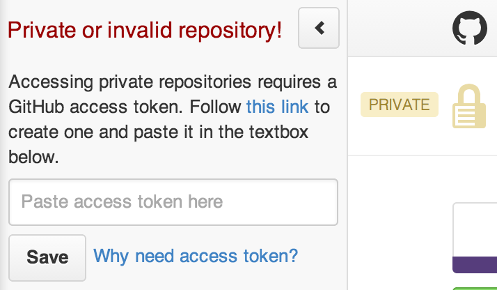

## Octotree
Browser extensions (Chrome, Firefox, Safari and Opera) to display GitHub code in tree format. Useful for developers who frequently read source in GitHub and do not want to download or checkout too many repositories. Features:

* Easy-to-navigate code tree like IDEs
* Fast browsing with pjax
* Customizable hotkey
* Support private repositories (require [personal access token](#github-api-rate-limit))

## Install on Chrome
* Download and install [Octotree](https://chrome.google.com/webstore/detail/octotree/bkhaagjahfmjljalopjnoealnfndnagc) from the Chrome store
* Navigate to any GitHub project (or just refresh this page as an example)
* The code tree should show on the left-hand side of the screen

## Install on Firefox, Safari and Opera
You can just install the prebuilt extensions located in the [dist](https://github.com/buunguyen/octotree/tree/master/dist) folder. For security reason, be sure to install from this location only.

* Firefox: drag `octotree.xpi` to the browser and follow the instructions
* Safari: drag `octotree.safariextz` to the browser and follow the instructions
* Opera: drag `octotree.nex` to the browser and follow the instructions

## GitHub API Rate Limit
Octotree uses [GitHub API](https://developer.github.com/v3/) to retrieve repository metadata. By default, it makes unauthenticated requests to the GitHub API. However, there are two situations when requests must be authenticated:

* You access a private repository
* You exceed the [rate limit of unauthenticated requests](https://developer.github.com/v3/#rate-limiting)

When that happens, Octotree shows the screen below to ask for your [GitHub personal access token](https://help.github.com/articles/creating-an-access-token-for-command-line-use). If you don't already have one, [create one](https://github.com/settings/tokens/new), then copy and paste it into the textbox. Note that the minimal scopes that should be granted are `public_repo` and `repo` (if you need access to private repositories).



Alternatively, you can manually enter or update the token by following these steps:

* Navigate to any GitHub page
* Open the Chrome (or Safari, Firefox) developer console
* Execute the following line:
```javascript
localStorage.setItem('octotree.github_access_token', 'REPLACE WITH TOKEN')
```

## Changelog
### [v1.3](https://github.com/buunguyen/octotree/issues?labels=&milestone=3&page=1&state=closed)
* Setting panel allowing:
 * Changing access token
 * Changing hotkeys
 * Changing sidebar default visibility
 * Changing folder collapsing option
* Sidebar appears better in large monitors
* More responsive in big repositories
* And bug fixes

### [v1.2](https://github.com/buunguyen/octotree/issues?labels=&milestone=1&page=1&state=closed)
* Hide sidebar by default (upon many user requests)
* Hotkey (`cmd+b`, `ctrl+b`) to toggle sidebar
* Sidebar is now resizable
* Support rendering submodules
* Reflect GitHub selection to Octotree
* New sidebar header and progress indicator
* And bug fixes

### [v1.1](https://github.com/buunguyen/octotree/issues?labels=&milestone=2&page=1&state=closed)
* New UI that blends better with GitHub!
* Hide Octotree on non-code pages
* When asking for token, show more detailed message and not fly out automatically
* Extend pjax timeout to work better with big files
* Sanitize file and folder names before displaying
* Fix error when a branch name contains slashes
* Gulp script to build for Chrome, Firefox and Safari
* And some other minor changes


## Credit
* Thanks to everyone who submit pull requests, report bugs and suggest ideas on GitHub and on [HN](https://news.ycombinator.com/item?id=7740226)
* [Extension icon](https://github.com/pstadler/octofolders) by [pstadler](https://github.com/pstadler)