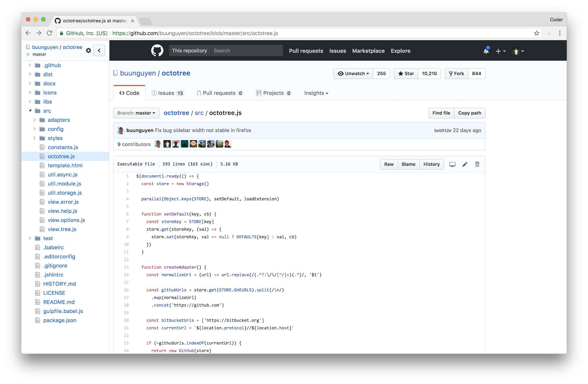
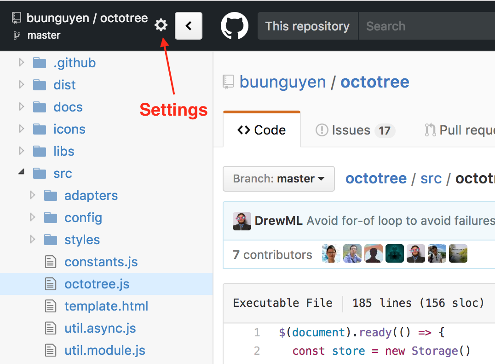

[](#backers)
[](#sponsors)

## Octotree
Browser extension (Chrome, Firefox, Opera and Safari) to show a code tree on GitHub. Awesome for exploring project source without having to pull every single repository to your machine. Features:

* Easy-to-navigate code tree, just like in IDEs
* Fast browsing with pjax
* Support private repositories (see [instructions](#access-token))
* Support GitHub Enterprise (Chrome and Opera only, see [instructions](#enterprise-urls))



### Install on Chrome, Firefox and Opera
* Install Octotree from [Chrome Web Store](https://chrome.google.com/webstore/detail/octotree/bkhaagjahfmjljalopjnoealnfndnagc), [Mozilla Add-ons Store](https://addons.mozilla.org/en-US/firefox/addon/octotree/) or [Opera Add-ons Store](https://addons.opera.com/en/extensions/details/octotree/)
* Navigate to any GitHub repository (or just refresh this page as an example)
* The code tree should show on the left-hand side of the screen

__Note__: to configure Octotree for GitHub Enteprise, see [instructions](#enterprise-urls)

### Install on Safari

Octotree is not available on the Safari gallery. You have to build from source.  Download this repo and run the following command:

```bash
gulp safari
```

Find the extension folder in `tmp/safari`. Follow Apple instructions to install the extension to your browser.

### Install from prebuilt packages (all browsers)

Prebuilt packages are available in the  [dist](https://github.com/buunguyen/octotree/tree/master/dist) folder. For security reason, only download Octotree from this location.

__Note__: Firefox 43+ requires add-ons to be signed. Therefore, you should install Octotree from the Mozilla store. For some reason if you want to install the prebuilt package instead, you have to [disable sign-check](https://github.com/buunguyen/octotree/issues/220#issuecomment-166012724).

## Settings
### Access Token

__Note for the paranoids (like me!)__: Octotree stores access tokens in your browser local storage and never transmits it anywhere.

#### GitHub
Octotree uses [GitHub API](https://developer.github.com/v3/) to retrieve repository metadata. By default, it makes unauthenticated requests to the GitHub API. However, there are two situations when requests must be authenticated:

* You access a private repository
* You exceed the [rate limit of unauthenticated requests](https://developer.github.com/v3/#rate-limiting)

When that happens, Octotree will ask for your [GitHub personal access token](https://help.github.com/articles/creating-an-access-token-for-command-line-use). If you don't already have one, [create one](https://github.com/settings/tokens/new), then copy and paste it into the textbox. Note that the minimal scopes that should be granted are `public_repo` and `repo` (if you need access to private repositories).

#### Bitbucket (experimental)
Octotree uses [Bitbucket API](https://confluence.atlassian.com/bitbucket/repositories-endpoint-1-0-296092719.html) to retrieve repository metadata. By default, Octotree asks for your [Bitbucket App password](https://confluence.atlassian.com/bitbucket/app-passwords-828781300.html). If you don't already have one, [create one](https://bitbucket.org/account/admin/app-passwords) (the minimal requirement is `Repositories`'s `Read` permission), then copy and paste it into the textbox.

Note that Octotree extracts your username from the current page to invoke the Bitbucket API. If fail to do so, Octotree will ask you for a token update, you just need to prepend your username to the token, separated by a colon, i.e. `USERNAME:TOKEN`.

### Enterprise URLs
By default, Octotree only works on `github.com`. To support enterprise version (Chrome and Opera only), you must grant Octotree sufficient permissions. Follow these steps to do so:

* Go to any GitHub repo
* Open the Octotree settings panel



* Fill in the GitHub Enterprise URLs textbox, __one URL per line__
* Click Save and accept the permission prompt
* Navigate to your GitHub Enterprise site
* You might be asked to create an [access token](#access-token)

### Others
* __Hotkeys__: Octotree uses [keymaster](https://github.com/madrobby/keymaster) to register hotkeys. Check out the [supported keys](https://github.com/madrobby/keymaster#supported-keys).
* __Remember sidebar visibility__: if checked, show or hide Octotree based on its last visibility.
* __Show in non-code pages__: if checked, allow Octotree to show in non-code pages such as Issues and Pull Requests.
* __Load entire tree at once__: if checked, load and render the entire code tree at once. To avoid long loading, this should be unchecked if you frequently work with very large repos.
* __Show only pull request changes__ _(new!)_: if checked and in "Pull requests" page, only show the change set of the pull request.

## Credits
* [@crashbell](https://github.com/crashbell) for helping with GitLab and others
* [@Ephemera](https://github.com/Ephemera) for fixing many bugs
* [@athaeryn](https://github.com/athaeryn) and [@letunglam](https://github.com/letunglam) for helping with UI design
* And many other people who submit bug fixes and reports

## Donate

Loving Octotree? [Donating](https://opencollective.com/octotree) to help us continue working on it.
