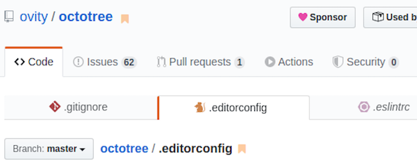
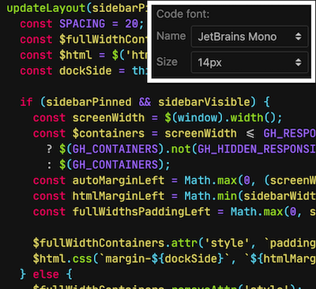
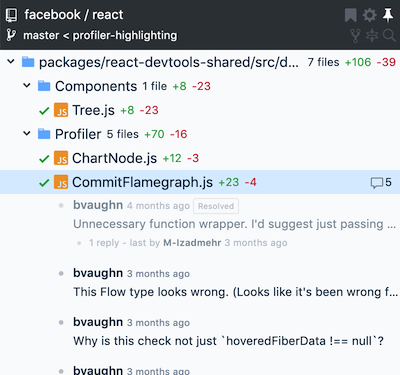
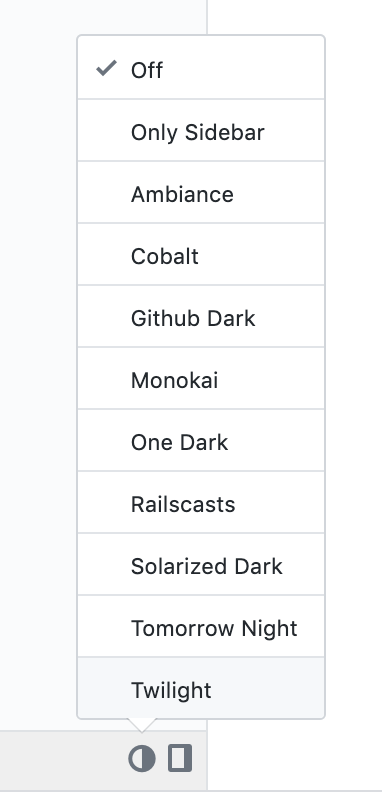

## About

Browser extension that brings GitHub experience to the next level. This repository contains the source code of Octotree Core. You can build and run it locally to access all features of the free version. Or you can download the full version on [our website](https://www.octotree.io). Octotree supports Chrome, Firefox, Opera and Safari.

## Settings

### Access Token

Octotree uses the [GitHub API](https://developer.github.com/v3/) to retrieve repository metadata. By default, it makes unauthenticated requests to get these data. However, there are two situations when GitHub require such requests to be authenticated:

- You access a private repository
- You exceed the [API rate limit](https://developer.github.com/v3/#rate-limiting)

When that happens, Octotree will ask for your [GitHub personal access token](https://help.github.com/articles/creating-an-access-token-for-command-line-use). If you don't already have one, [create one](https://github.com/settings/tokens/new?scopes=repo&description=Octotree%20browser%20extension), then copy and paste it into the token textbox in the Settings screen. Note that the minimal scopes that should be granted are `public_repo` and `repo` (if you need access to private repositories).

**No BS Policy**: Octotree doesn't collect/share/care about your data at all. It stores the access token in your [browser storage](https://developer.mozilla.org/en-US/docs/Mozilla/Add-ons/WebExtensions/API/storage/sync) and uses it only to communicate with GitHub API (see the code that does that [here](https://github.com/ovity/octotree/blob/559291ed9017f0c3429bc49419d001d9ea0ac510/src/adapters/github.js#L296-L313)).

**Access tokens are stored in the browser storage, only enter access tokens when you use a TRUSTED computer.**

### Multiple Access Tokens (Pro)

If you have multiple GitHub accounts with access to different private repositories, you can let Octotree know which access token to use for which account.
When you login to GitHub with an account, Octotree will use the matching token to make API requests to GitHub. If you don't login to GitHub or if the account you login is not in the account list, Octotree will use the default access token.

Go to Settings and click the + icon to add more accounts. Similar to access token, these accounts and tokens are stored in the browser's storage. Therefore, only enter these on a TRUSTED computer.

### Hotkeys

Hotkeys to pin or unpin the sidebar. You can enter multiple hotkeys by separating them with a comma.

- Supported modifiers: `⇧`, `shift`, `option`, `⌥`, `alt`, `ctrl`, `control`, `command`, and `⌘`.
- Supported special keys: `backspace`, `tab`, `clear`, `enter`, `return`, `esc`, `escape`, `space`, `up`, `down`, `left`, `right`, `home`, `end`, `pageup`, `pagedown`, `del`, `delete` and `f1` through `f19`.

Learn more at [keymaster](https://github.com/madrobby/keymaster#supported-keys).

### Others

- **Show sidebar on hover**. If checked, hover the Octotree button to open the sidebar. Otherwise, click the button to open the sidebar.
- **Show file-type icons**. If checked, show different icons for different file types.
- **Enable bookmarking**. If checked, show the bookmark icon for repositories, files, pull requests and issues.
- **Enable Octotree in pages (Pro)**. Control the GitHub pages in which Octotree shows up.
- **Cache repositories locally (Pro)**. Whether to cache the repository file structure in **local machine cache** (via browser Cache API). This *significantly* speeds up subsequent visits to large repositories and reduces the number of API requests to GitHub.
- **Lazy-load code tree**. By default, Octotree loads everything in a single API request to render the full code tree. It could be slow if working with a large repository. If you frequently work with big repositories, you should select this option so that Octotree only loads and renders the code tree lazily.
- **Enable multi-tab (Pro)**. What it says.
- **Font settings (Pro)**. This will affect the source code font only.

## Pro Features

The following features require [Pro subscription](https://www.octotree.io/pricing).

### GitHub Enterprise

_Note: GitHub Enterprise is not supported on Safari._

Follow these steps to enable Octotree for GitHub Enterprise:

* Navigate to any repository on github.com (**not** GitHub Enterprise)
* Open the Octotree sidebar
* Click the login link in the footer (or in Settings view)
* Login using your Octotree account
* Navigate to your GitHub Enterprise domain
* Right-click the Octotree icon the browser bar (see image below) select "Enable Octotree on this domain"

### Multi-tab

Double-click a file on the sidebar to open it in a new tab. Switching among tabs is very fast because they're cached
in the browser. Tabs and their scroll position are cached locally so they survive reloads.

### Code font settings

Easily change code font type and size. Open the Settings screen to select among the built-in fonts.

### Code review pack

A collection of features that make pull request review awesome:

* Show PR files, changes and comments
* Show file view status
* View full file by clicking the "View full" button at the top of each file

### Performance pack

This package includes features that boost up performance when working with large repositories:

* Repository caching. Whether to cache the repository file structure in **local machine cache** (via browser Cache API). This *significantly* speeds up subsequent visits to large repositories and reduces the number of API requests to GitHub.
* Activate lazy-loading for specific repositories by clicking the ⚡️ icon in the Octotree sidebar header. Lazy-loading is helpful when you work with a big repositories (e.g. Linux, Kubernetes). The downside is it requires Octotree to make an API request and render every subdirectory as you click on the directory. This feature allows you to activate lazy-load for only certain repositories.

### Multiple themes

Click the theme icon located at the bottom of Octotree to select a color theme. The "Only Sidebar" theme changes the Octotree sidebar to the dark theme without changing the theme of the GitHub page. This is helpful if you already use another mechanism to show GitHub in dark mode.

### Change docking position

Click the dock icon at the footer of Octotree to change the sidebar location to the right or left of the screen.

### Repo/PR/issue/file bookmark

You can click the bookmark icon next to a repository, pull request, issue or file name to bookmark it. You can view the list of bookmarks by clicking the bookmark icon in Octotree header.

### File search

Click the search icon to start file search.

Note that when lazy-loading is used, search only works with directories and files that were already loaded.

### Collapse tree

Click the collapse tree icon at the Octotree sidebar header to collapse the code tree.

## Browser Permissions

Octotree Core (built from source from this repo) requires some [browser permissions](https://developer.chrome.com/extensions/declare_permissions):

* Read/change data in `github.com` and `api.github.com`: needed to show Octotree and make requests to GitHub API
* `storage`: needed to store Octotree settings

The full version of Octotree requires these additional permissions:

* Read/change data in `octotree.io`: needed to authenticate users and load/store bookmarks from Octotree API
* `contextMenus`: needed to show Octotree context menu items
* `activeTab`: needed for context menu actions to trigger enabling/disabling Octotree in GitHub Enterprise domains

The following permissions are **optional** and only requested when you enable Octotree in a GitHub Enterprise domain (\*):

* `webNavigation`: needed to inject Octotree sidebar in GitHub Enterprise domains
* `tabs`: needed to inject Octotree sidebar in GitHub Enterprise domains

\*: when enabling Octotree in a GitHub Enterprise domain, Chrome displays the prompt for the "Read your browsing history" permission. That's a bit confusing as Octotree doesn't request the `history` permission or collect your data at all. See [this discussion](https://github.com/ovity/octotree/issues/844#issuecomment-557364850) for more details. Firefox, on the other hand, is clearer about the specific permissions being requested by Octotree.

## Credits

Octotree uses the following open-source software:

- [jQuery](https://github.com/jquery/jquery)
- [jQuery UI](https://github.com/jquery/jquery-ui)
- [jstree](https://github.com/vakata/jstree)
- [file-icons-js](https://github.com/websemantics/file-icons-js)
- [keymaster](https://github.com/madrobby/keymaster)
- [jquery-pjax](https://github.com/defunkt/jquery-pjax)
- [github-dark](https://github.com/StylishThemes/GitHub-Dark)
