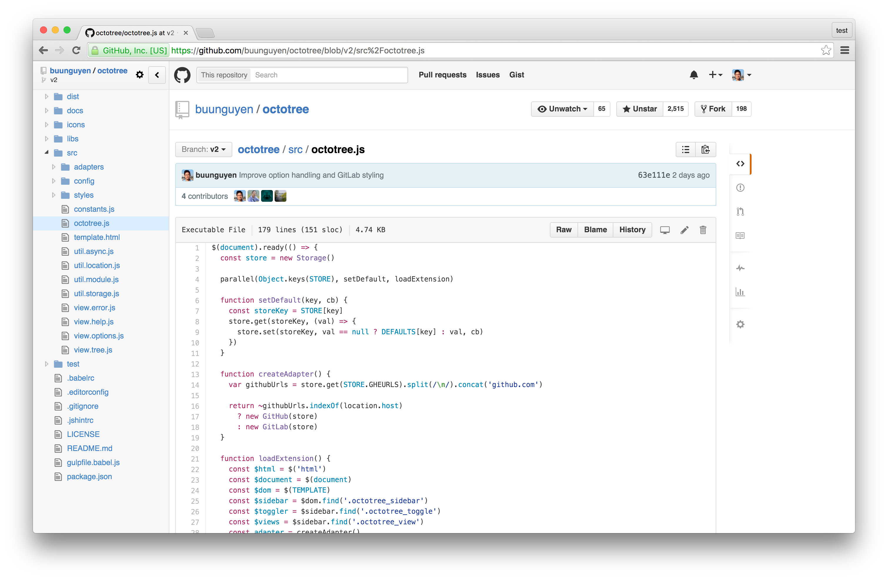
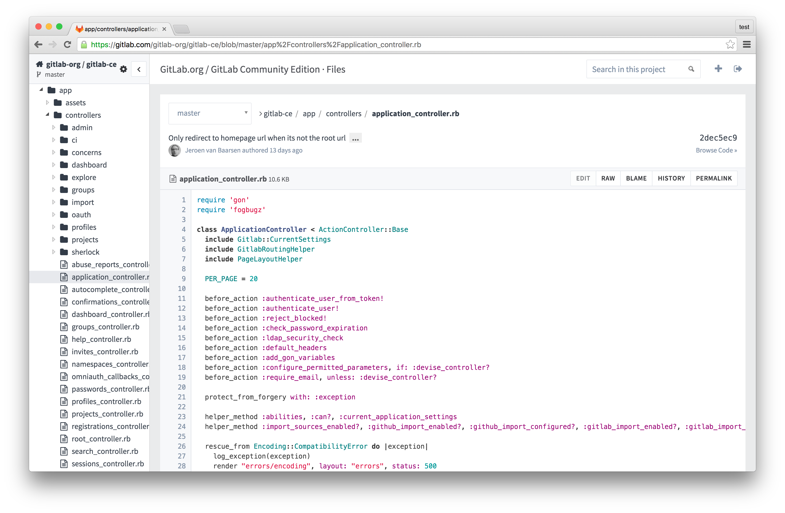

## Octotree
Browser extensions (Chrome, Firefox, Opera and Safari) to display GitHub and GitLab code in tree format. Useful for developers who frequently read source and do not want to download or checkout too many repositories. Features:

* Easy-to-navigate code tree like IDEs
* Fast browsing with pjax and Turbolinks
* Support private repositories (see [instructions](#access-token))
* Support GitHub and GitLab Enterprise (Chrome and Opera only, see [instructions](#enterprise-urls))

### Install on Chrome, Firefox and Opera
* Install Octotree from [Chrome Web Store](https://chrome.google.com/webstore/detail/octotree/bkhaagjahfmjljalopjnoealnfndnagc), [Mozilla Add-ons Store](https://addons.mozilla.org/en-US/firefox/addon/octotree/) or [Opera Add-ons Store](https://addons.opera.com/en/extensions/details/octotree/)
* Navigate to any GitHub repository (or just refresh this page as an example)
* The code tree should show on the left-hand side of the screen

### Install on Safari

Octotree is not available on the Safari gallery. Instead, you must use the prebuilt package or build one from source.

* Download the [Safari prebuilt package](https://github.com/buunguyen/octotree/tree/master/dist)
* Double-click or drag it to Safari

### Install prebuilt packages (all browsers)

Prebuilt packages are available in the  [dist](https://github.com/buunguyen/octotree/tree/master/dist) folder. For security reason, only download Octotree from this location.

Firefox 43+ requires add-ons to be signed. Therefore, you should install Octotree from the Mozilla store. For some reason if you want to install the prebuilt package instead, you have to [disable sign-check](https://github.com/buunguyen/octotree/issues/220#issuecomment-166012724).

## Settings
### Access Token
#### GitHub
Octotree uses [GitHub API](https://developer.github.com/v3/) to retrieve repository metadata. By default, it makes unauthenticated requests to the GitHub API. However, there are two situations when requests must be authenticated:

* You access a private repository
* You exceed the [rate limit of unauthenticated requests](https://developer.github.com/v3/#rate-limiting)

When that happens, Octotree will ask for your [GitHub personal access token](https://help.github.com/articles/creating-an-access-token-for-command-line-use). If you don't already have one, [create one](https://github.com/settings/tokens/new), then copy and paste it into the textbox. Note that the minimal scopes that should be granted are `public_repo` and `repo` (if you need access to private repositories).

#### GitLab
Octotree uses [GitLab API](http://doc.gitlab.com/ce/api/) to retrieve repository metadata. By default, Octotree attempts to retrieve the access token embedded in the GitLab DOM and use the token to authenticate against the GitLab API. If Octotree cannot retrieve the token, it will prompt you to [create one](https://gitlab.com/profile/account).

### Enterprise URLs
By default, Octotree only works on `github.com` and `gitlab.com`. To support enterprise version on Chrome and Opera, you must grant Octotree sufficient permissions. Follow these steps to do so:

* Navigate to any GitHub or GitLab repository
* Open Octotree's settings panel
* Fill in the Enterprise URLs textbox, _one URL per line_
* Click Save and accept any permission prompt
* Navigate to your GitHub or GitLab Enterprise site
* You might be asked to create an [access token](#access-token)

### Others
* __Hotkeys__: Octotree uses [keymaster](https://github.com/madrobby/keymaster) to register hotkeys. Checkout the [supported keys](https://github.com/madrobby/keymaster#supported-keys).
* __Remember sidebar visibility__: if checked, show or hide Octotree based on its last visibility.
* __Show in non-code pages__: if checked, allow Octotree to show in non-code pages such as Issues and Pull Requests.
* __Load entire tree at once__: if checked, load and render the entire code tree at once. To avoid long loading, this should be unchecked if you frequently work with very large repos.

## Changelog

### v2.0.0
* Support GitLab
* Add ability to lazy-load individual folders
* Simplify Octotree settings
* Store settings for each host separately
* Support new GitHub layout
* And various bug fixes

### v1.7.2
* Fix bug long branches are not loaded correctly due to GitHub DOM change

### v1.7.1
* Fix space between tree and GitHub contents due to GitHub DOM change

### v1.7.0
* Support direct downloading when hovering a file

### v1.6.4
* Fix bug detecting branch/tag due to GitHub DOM change

### v1.6.3
* Fix bug when switching to branches with slashes in their names

### v1.6.2
* Fix branch selection no longer works due to GitHub change

### v1.6.1
* Update buttons' style to match GitHub new button style

### v1.6
* Update all dependencies to latest version
* Allow navigating to commit trees https://github.com/buunguyen/octotree/issues/157
* Support keyboard navigation https://github.com/buunguyen/octotree/issues/158
* Fix bug handling back tick in paths https://github.com/buunguyen/octotree/issues/160

### v1.5.3
* Fix bug https://github.com/buunguyen/octotree/pull/149
* Fix bug https://github.com/buunguyen/octotree/issues/151
* Fix bug https://github.com/buunguyen/octotree/issues/155

### v1.5.2
* Fix bug https://github.com/buunguyen/octotree/issues/147

### v1.5
* Option to show in non-code pages
* Option to load tree only when sidebar is visible
* Option to configure tab size
* Bug fixes

### v1.4.1
* New header to match new GitHub design
* Bug fixes

### v1.4
* Support GitHub enterprise
* Change default hotkey (`cmd+b` for Safari and `cmd+shift+s` for all other browsers)
* Some other minor changes

### v1.3
* Setting panel allowing:
 * Changing access token
 * Changing hotkeys
 * Changing sidebar default visibility
 * Changing folder collapsing option
* Sidebar appears better in large monitors
* More responsive in big repositories
* And bug fixes

### v1.2
* Hide sidebar by default (upon many user requests)
* Hotkey (`cmd+b`, `ctrl+b`) to toggle sidebar
* Sidebar is now resizable
* Support rendering submodules
* Reflect GitHub selection to Octotree
* New sidebar header and progress indicator
* And bug fixes

### v1.1
* New UI that blends better with GitHub!
* Hide Octotree on non-code pages
* When asking for token, show more detailed message and not fly out automatically
* Extend pjax timeout to work better with big files
* Sanitize file and folder names before displaying
* Fix error when a branch name contains slashes
* Gulp script to build for Chrome, Firefox and Safari
* And some other minor changes

## Credits
* @crashbell for helping GitLab and others
* @Ephemera for fixing many bugs
* @athaeryn and @letunglam for the UI design
* @pstadler for the [extension icon](https://github.com/pstadler/octofolders)
* And many other people who submit bug fixes and reports
