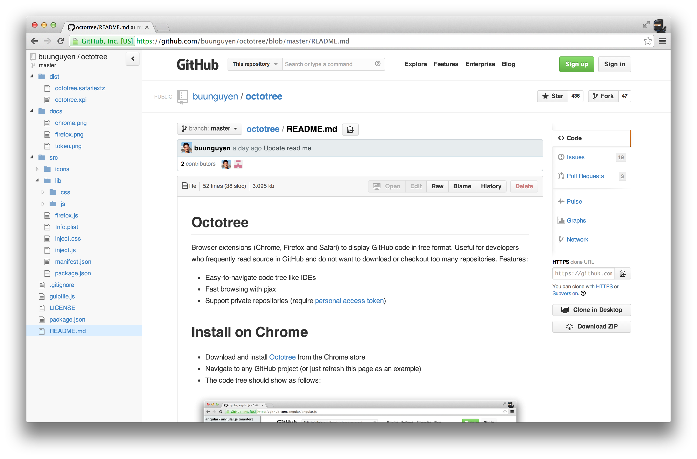
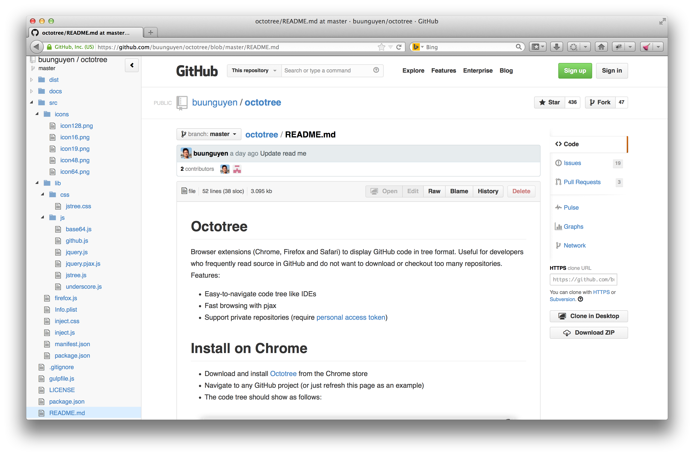
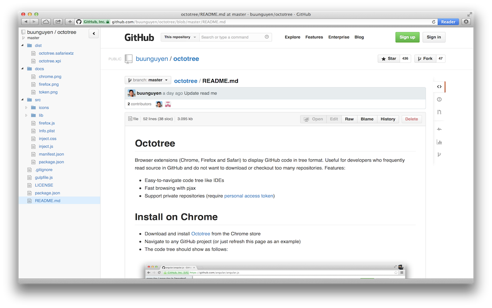

## About

Browser extension (Chrome, Firefox, Edge, Opera, Safari) that improves GitHub code review and exploration. This repository is for submitting bugs and feature requests. (Check out the master branch for the source code of a limited version of Octotree.) You can download Octotree by clicking the icons below or from [our website](https://www.octotree.io/). 

### Learn more:

* [User guide](https://www.octotree.io/features)
* [Browser permissions](https://www.octotree.io/features#browser-permissions)

