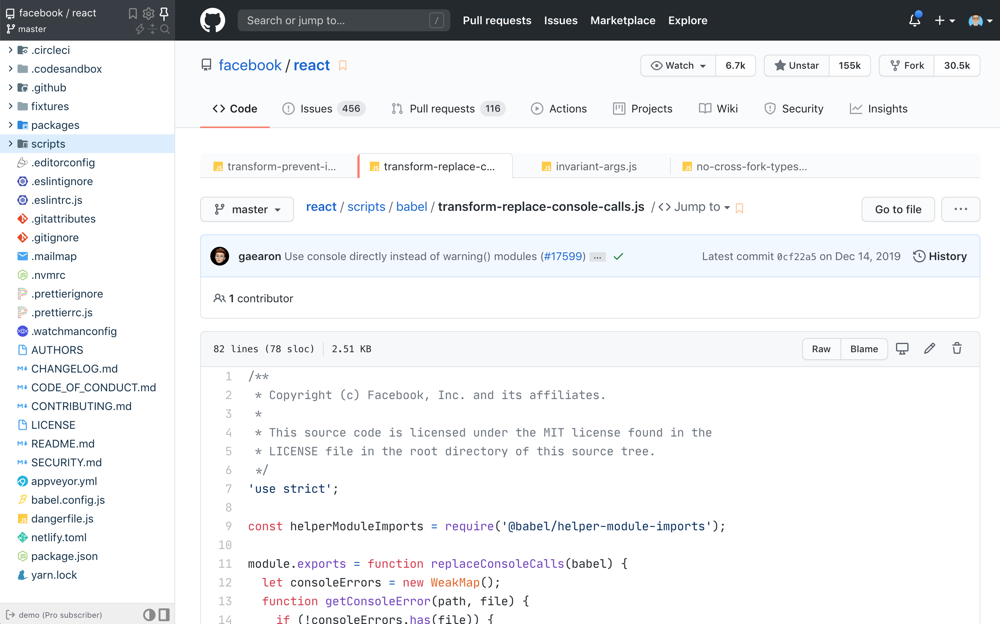

## About

Browser extension that enhances GitHub code review and exploration. You can download Octotree for your browser from [our website](https://www.octotree.io). Octotree supports Chrome, Firefox, Edge, Opera and Safari.

### Support

Please check out the [troubleshooting guide](https://github.com/ovity/octotree/issues/1025) to see if it solves the problem. If it doesn't, please either create [a forum ticket](https://github.com/ovity/octotree/issues/new) or send an email to support@octotree.io.

### Learn more

- [Demo](https://www.youtube.com/watch?v=tyUNy-WFs-c)
- [User guide](https://www.octotree.io/features)
- [Authentication](https://www.octotree.io/features#authentication)
- [Browser permissions](https://www.octotree.io/features#browser-permissions)

### Copyright

Octotree is a proprietary software. This repository contains the old source code of a very limited version of Octotree. The Octotree team owns the complete copyright over this code.
