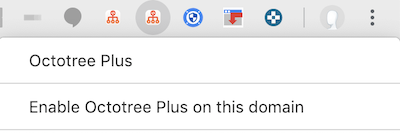
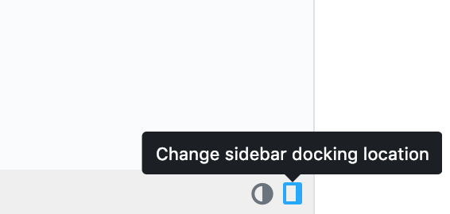
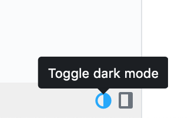
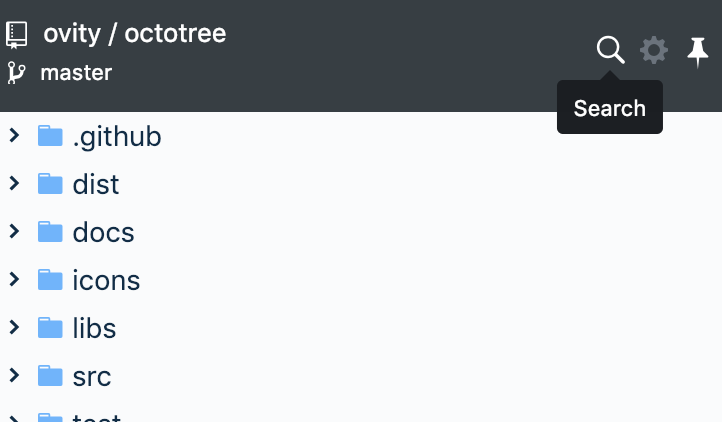

## Octotree

Browser extension (Chrome, Firefox, Opera and Safari) to show a code tree on GitHub. Awesome for exploring project source without having to pull every single repository to your machine. Available as both a free and open-source community version and a commercial premium version.

**Features**

- Easy-to-navigate code tree, just like in IDEs
- Fast browsing with pjax
- Support private repositories (see [instructions](#access-token))

**Features of Octotree Plus**

- Dark mode
- File search
- Change docking position
- Multiple GitHub accounts
- Support GitHub Enterprise on Chrome, Opera and Firefox
- Official Safari version

Learn more about these features from [our website](https://www.octotree.io).

### Install Octotree

- Octotree: [Chrome](https://chrome.google.com/webstore/detail/octotree/bkhaagjahfmjljalopjnoealnfndnagc), [Firefox](https://addons.mozilla.org/en-US/firefox/addon/octotree/), [Opera](https://addons.opera.com/en/extensions/details/octotree/)
- Octotree Plus: [Chrome](), [Firefox](), [Opera](), [Safari]()

## Settings

### Access Token

Octotree uses the [GitHub API](https://developer.github.com/v3/) to retrieve repository metadata. By default, it makes unauthenticated requests to get these data. However, there are two situations when GitHub require such requests to be authenticated:

- You access a private repository
- You exceed the [API rate limit](https://developer.github.com/v3/#rate-limiting)

When that happens, Octotree will ask for your [GitHub personal access token](https://help.github.com/articles/creating-an-access-token-for-command-line-use). If you don't already have one, [create one](https://github.com/settings/tokens/new?scopes=repo&description=Octotree%20browser%20extension), then copy and paste it into the token textbox in the Settings screen. Note that the minimal scopes that should be granted are `public_repo` and `repo` (if you need access to private repositories).

**No BS Policy**: Octotree doesn't collect/share/care about your data at all. It stores the access token in your browser local storage and uses it only to communicate with GitHub API (see the code that does that [here](https://github.com/ovity/octotree/blob/559291ed9017f0c3429bc49419d001d9ea0ac510/src/adapters/github.js#L296-L313)).

**Access tokens are stored in the browser's local storage, do NOT provide access tokens if you use public computers.**

### Hotkeys

Hotkeys to pin or unpin the sidebar. You can enter multiple hotkeys by separating them with a comma.

- Supported modifiers: `⇧`, `shift`, `option`, `⌥`, `alt`, `ctrl`, `control`, `command`, and `⌘`.
- Supported special keys: `backspace`, `tab`, `clear`, `enter`, `return`, `esc`, `escape`, `space`, `up`, `down`, `left`, `right`, `home`, `end`, `pageup`, `pagedown`, `del`, `delete` and `f1` through `f19`.

Learn more at [keymaster](https://github.com/madrobby/keymaster#supported-keys).

### Others

- **Load entire tree at once**: if checked, load the entire code tree at once. For large repos where Octotree can't load it in a single request, Octotree ignores this settings and lazily-loads the repo.
- **Show in non-code pages**: if checked, show Octotree in non-code pages such as Issues and Wiki.
- **Show file-specific icons**: if checked, show different icons for different file types.
- **Show only pull request changes**: if checked, show only the change set of a pull request.

### Octotree Plus Settings

#### GitHub Enterprise

_Note: GitHub Enterprise is not supported on Safari._

After installing Octotree Plus, navigate to your GitHub Enterprise site. Right-click the Octotree Plus icon in the browser bar (see the image below) and select "Enable Octotree Plus on this domain". The page should refresh and Octotree Plus sidebar should show up. Alternatively, you can disable Octotree Plus on a domain by selecting "Disable Octotree Plus on this domain".

#### Multiple GitHub Accounts

If you have multiple GitHub accounts with access to different private repositories, you will need to let Octotree know which access token to use for which account.
This feature allows you to enter additional GitHub accounts and corresponding tokens. When you login to GitHub with an account, Octotree will use the matching token to make API requests to GitHub. If you don't login to GitHub or if the account you login is not in the account list, Octotree will use the default access token.

Go to Settings and click the + button to add more accounts.

#### Change Docking Position

You can change the location of the Octotree sidebar to either the left or right side of the screen. Click the dock button located at the bottom of Octotree to toggle the sidebar location.

#### Dark Mode

Click the dark mode button located at the bottom of Octotree to toggle dark mode.

#### File Search

Click the search icon and type in search query. **Note:** this feature requires the "Load entire tree at once" option to be selected.

## Contribution

1.  Install [node 8 or above](https://nodejs.org/en/download/)
1.  Run `npm install` to install dependencies
1.  Run `npm start` to watch code changes and build unpacked extensions
1.  Load the unpacked extensions in the `tmp` folder (check instructions of the specific browser)
1.  Please follow existing style for new code

## Team

- [Buu Nguyen](https://github.com/buunguyen)
- [Duy Lam](https://github.com/duylam)
- [An Nguyen](https://github.com/crashbell)

### Credits

Octotree and Octotree Plus use the following open-source software:

- [jQuery](https://github.com/jquery/jquery)
- [jQuery UI](https://github.com/jquery/jquery-ui)
- [jstree](https://github.com/vakata/jstree)
- [file-icons](https://github.com/file-icons/atom)
- [keymaster](https://github.com/madrobby/keymaster)
- [jquery-pjax](https://github.com/defunkt/jquery-pjax)
- [github-dark](https://github.com/StylishThemes/GitHub-Dark)
