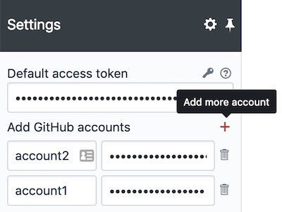
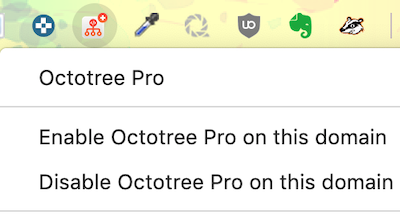

## About

Browser extension that brings GitHub experience to the next level. This repository contains the source code of Octotree core. You can build and run it locally to access all features of the free version. Or you can download the full version on [our website](https://www.octotree.io). Octotree supports Chrome, Firefox, Opera and Safari.

## Features and Settings

### Access Token

Octotree uses the [GitHub API](https://developer.github.com/v3/) to retrieve repository metadata. By default, it makes unauthenticated requests to get these data. However, there are two situations when GitHub require such requests to be authenticated:

- You access a private repository
- You exceed the [API rate limit](https://developer.github.com/v3/#rate-limiting)

When that happens, Octotree will ask for your [GitHub personal access token](https://help.github.com/articles/creating-an-access-token-for-command-line-use). If you don't already have one, [create one](https://github.com/settings/tokens/new?scopes=repo&description=Octotree%20browser%20extension), then copy and paste it into the token textbox in the Settings screen. Note that the minimal scopes that should be granted are `public_repo` and `repo` (if you need access to private repositories).

**No BS Policy**: Octotree doesn't collect/share/care about your data at all. It stores the access token in your browser local storage and uses it only to communicate with GitHub API (see the code that does that [here](https://github.com/ovity/octotree/blob/559291ed9017f0c3429bc49419d001d9ea0ac510/src/adapters/github.js#L296-L313)).

**Access tokens are stored in the browser's local storage, only enter access tokens when you use a trusted computer.**

### Multiple Access Tokens (Pro)

If you have multiple GitHub accounts with access to different private repositories, you can let Octotree know which access token to use for which account.
When you login to GitHub with an account, Octotree will use the matching token to make API requests to GitHub. If you don't login to GitHub or if the account you login is not in the account list, Octotree will use the default access token.

Go to Settings and click the + icon to add more accounts. Similar to access token, these accounts and tokens are stored in the browser's local storage.

### Hotkeys

Hotkeys to pin or unpin the sidebar. You can enter multiple hotkeys by separating them with a comma.

- Supported modifiers: `⇧`, `shift`, `option`, `⌥`, `alt`, `ctrl`, `control`, `command`, and `⌘`.
- Supported special keys: `backspace`, `tab`, `clear`, `enter`, `return`, `esc`, `escape`, `space`, `up`, `down`, `left`, `right`, `home`, `end`, `pageup`, `pagedown`, `del`, `delete` and `f1` through `f19`.

Learn more at [keymaster](https://github.com/madrobby/keymaster#supported-keys).

#### GitHub Enterprise (Pro)

_Note: GitHub Enterprise is not supported on Safari._

After installing Octotree, navigate to your GitHub Enterprise site. Right-click the Octotree icon in the browser bar (see the image below) and select "Enable Octotree on this domain". The page should refresh and Octotree Pro sidebar should show up. Alternatively, you can disable Octotree Pro on a domain by selecting "Disable Octotree on this domain".

### Others

- **Show sidebar on hover**. If checked, hover the Octotree button to open the sidebar. Otherwise, click the button to open the sidebar.
- **Load entire tree at once**. If checked, load and render the entire repository file structure at once. Otherwise, Octotree loads when a specific directory is clicked. For large repos where Octotree can't load in a single request, Octotree ignores this settings and lazily-loads the repo.
- **Show file-specific icons**. If checked, show different icons for different file types.
- **Show only pull request changes**. If checked, show only the change set of the current pull request. Otherwise, show the full code tree.
- **Enhanced code review (Pro)**. In the Pull Request page, you will automatically see file comments and file view status.
- **Multiple themes (Pro)**. Click the theme icon located at the bottom of Octotree to select a color theme. The "Only Sidebar" theme changes the Octotree sidebar to the dark theme without changing the theme of the GitHub page.
- **File search (Pro)**. Click the search icon to start file search. Note that this requires the "Load entire tree at once" option to be selected.
- **Change docking position (Pro)**. Click the dock icon at the footer of Octotree to change the sidebar location to the right or left of the screen.
- **Repository and PR bookmark (Pro)**. When viewing a repository or pull request, you can click the bookmark icon next to its title to bookmark it. You can view all bookmarks by clicking the bookmark icon in Octotree header.
- **Octotree visibility (Pro)**. Control which pages Octotree will show up in by choosing among the provided options.
- **Repository caching (Pro)**. Whether to cache the repository file structure in **local machine cache** (via browser Cache API). This speeds up loading of large repositories and reduces the number of API requests to GitHub.

### Browser Permissions

Octotree Core (built from source from this repo) requires some [browser permissions](https://developer.chrome.com/extensions/declare_permissions):

* Read/change data in `github.com` and `api.github.com`: needed to show Octotree and make requests to GitHub API
* `storage`: needed to store Octotree settings

The full version of Octotree requires these additional permissions:

* Read/change data in `octotree.io`: needed to authenticate users and load/store bookmarks from Octotree API
* `contextMenus`: needed to show Octotree context menu items
* `activeTab`: needed for context menu actions to trigger enabling/disabling Octotree in GitHub Enterprise domains

The following permissions are optional and only needed when you enable Octotree in a GitHub Enterprise domain:

* `webNavigation` (**optional**): needed to inject Octotree sidebar in GitHub Enterprise domains
* `tabs` (**optional**): needed to inject Octotree sidebar in GitHub Enterprise domains

*Note:* when enabling Octotree in a GitHub Enterprise domain, browsers request the "Read your browsing history" permission in order to grant the `tabs` and `webNavigation` permissions. That's a bit confusing as Octotree doesn't request the `history` permission or collect/share/care about your data. See [this discussion](https://github.com/ovity/octotree/issues/844#issuecomment-557364850) for more details.

### Credits

Octotree and Octotree Pro use the following open-source software:

- [jQuery](https://github.com/jquery/jquery)
- [jQuery UI](https://github.com/jquery/jquery-ui)
- [jstree](https://github.com/vakata/jstree)
- [file-icons](https://github.com/file-icons/atom)
- [keymaster](https://github.com/madrobby/keymaster)
- [jquery-pjax](https://github.com/defunkt/jquery-pjax)
- [github-dark](https://github.com/StylishThemes/GitHub-Dark)
